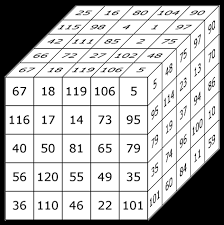

# IF3170_Tubes1_DiagMagicCube
 
| Names                  | NIM      | Tugas                      |
| ---------------------- |:--------:|:--------------------------:|
| Thea Josephine Halim   | 13522012 | Simulated Annealing        |
| Debrina Veisha R. W.   | 13522025 | Stochastic, Random Restart |
| Melati Anggraini       | 13522035 | Steepest Ascent, Sideways Move        |
| Raffael Boymian S      | 13522046 | Genetic Algorithm                    |

## The Problem 
 
A **diagonal magic cube** is a three-dimensional arrangement of numbers from 1 to n^3, where n is the length of a side of the cube, without repetition. These numbers are arranged in such a way that the sum of numbers along any row, column, pillar, space diagonal, or diagonal of any planar slice of the cube is always equal to a constant value known as the magic number. It's important to note that the magic number is not necessarily within the range of 1 to n^3 and is not one of the numbers placed within the cube.

## Table of Contents 💫
* [Features](#features)
* [Setting Up](#setting-up)

## Algorithms
- **HC Steepest Ascent** 
Steepest Ascent seeks to find the highest (or best) point in a landscape of possible solutions by moving only upward to neighboring points that improve the solution. "Steepest ascent" means it selects the neighboring point with the most improvement. It stops when no better neighbors are available, which could be a local maximum rather than the global maximum.

- **HC Sideways Move** 
Similar to steepest ascent, but if it reaches a point where all nearby solutions are equal in value (a plateau), it will make a few "sideways" moves to continue exploring the area. This can help avoid getting stuck on flat regions, but it may still miss the highest point if it doesn't break out of plateaus.

- **HC Random restart** 
Random restart restarts from a new, randomly chosen position each time it reaches a peak. This process is repeated multiple times, which increases the chances of finding the global maximum by exploring different parts of the solution space.

- **HC Stochastic** 
Instead of choosing the best neighbor, Stochastic picks a random neighbor that improves the solution. This randomness helps explore the solution space more broadly, allowing the algorithm to potentially escape local maxima.

- **Simulated Annealing** 
Inspired by the process of annealing in metallurgy, this Simulated Annealing starts by exploring widely (including potentially worse solutions) and gradually narrows down to the best solutions as it "cools down." Initially, it accepts worse solutions to escape local maxima, but over time it becomes more selective.

- **Genetic Algorithm** 
A biologically inspired algorithm that evolves solutions over generations. It uses a population of potential solutions and applies selection, crossover (mixing parts and combining of two solutions), and mutation to create a new generation. Over multiple generations, the population improves, ideally converging to a good or optimal solution.

## Setting Up
- Clone this repository with `git clone https://github.com/slntkllr01/IF3170_Tubes1_DiagMagicCube`
- Open up the terminal and run the main.py.

